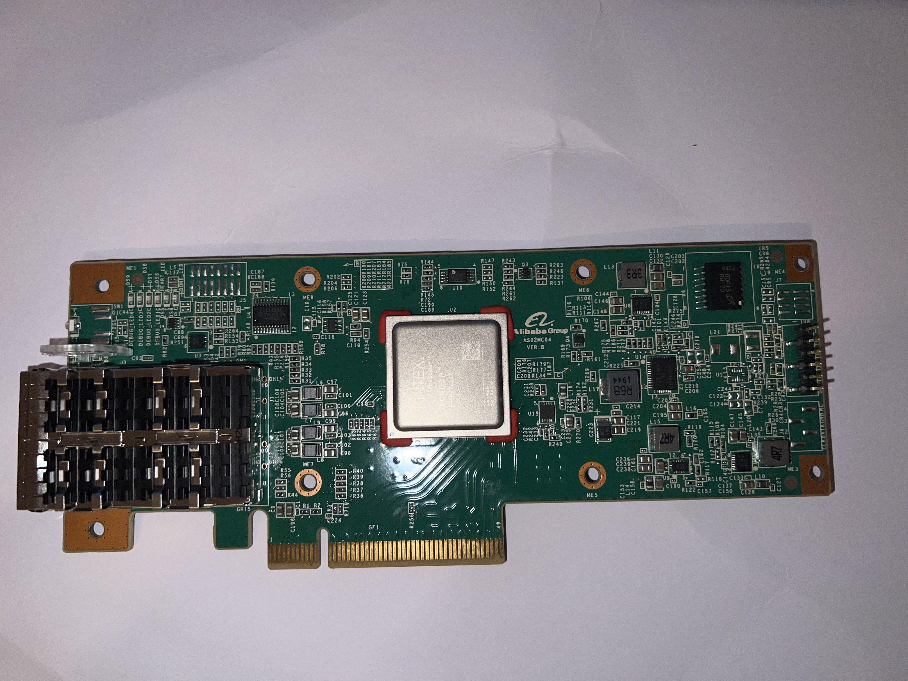

# Alibaba AS02MC04

Board support and programming resources for the Alibaba AS02MC04 NIC card,
recovered by reverse engineering. These files let you target the board in
AMD/Xilinx Vivado and program the FPGA over JTAG.

## Board Overview

The AS02MC04 (board model R1291-F9003-02) is a dual-SFP network interface
card built around a Xilinx Kintex UltraScale+ FPGA.

| Property        | Value                                    |
| --------------- | ---------------------------------------- |
| FPGA            | XCKU3P-FFVB676-2-E (Kintex UltraScale+)  |
| JTAG IDCODE     | 0x04A63093 (IR length 6)                 |
| System clock    | 100 MHz differential (Bank 67)           |
| SFP MGT refclk  | 156.25 MHz differential                  |
| PCIe refclk     | 100 MHz differential                     |
| Host interface  | PCI Express, up to x8                    |
| Network         | 2x SFP cages (GT lanes, I2C, status I/O) |
| Other           | 2x CAV24C64 I2C EEPROM, 7 user LEDs, reset button |

**Power:** The board is powered through the PCI Express edge connector. It must
be seated in a PCIe slot (or a powered PCIe riser/adapter) to power on,
including while programming over JTAG.

## Acknowledgements

This project builds on the work of two sources, with thanks to both:

- **TiferKing** — board files and reverse-engineering write-up:
  https://www.tiferking.cn/index.php/2025/01/06/721/
- **Julia Desmazes** — Alibaba Cloud FPGA analysis and JTAG programming notes:
  https://essenceia.github.io/projects/alibaba_cloud_fpga/

## Repository Contents

| Path                            | Description                                         |
| ------------------------------- | --------------------------------------------------- |
| `constrain_alibaba_as02mc04.xdc`| Pin constraints.                                     |
| `openocd_files/`                | OpenOCD configurations for JTAG programming.        |
| `board.jpeg`                    | Board photo showing the JTAG header location.       |


## Installing the Board Files in Vivado

1. Download the `as02mc04` board-files folder from the TiferKing repository:
   https://github.com/TiferKing/as02mc04_hack/tree/main/as02mc04

2. Copy that `as02mc04` folder into your Vivado installation:

   ```
   Vivado/<version>/data/boards/board_files/
   ```

   If the `board_files` directory does not exist, create it.

3. Restart Vivado and create a new project. The board now appears in the
   board selector as **AS02MC04 NIC Card**.

## Using the Constraints

`constrain_alibaba_as02mc04.xdc` contains the full pin mapping. Each port is
defined with a single `set_property -dict { ... } [get_ports ...]` command.

Notes:

- GT/MGT pins (SFP, PCIe) carry no `IOSTANDARD` constraints by design.
- For differential clock inputs, uncomment both the `_p` and `_n` lines, then
  add a `create_clock` for your actual frequency (template at the end of the
  file).

## Programming over JTAG

Programming the FPGA is a full pipeline: build the design in Vivado, convert
its bitstream to SVF, then play the SVF onto the board with OpenOCD.

### JTAG adapter

These configs were used with a Waveshare JTAG programmer based on the WCH
CH347 chip. Any JTAG adapter with OpenOCD support should work; just point the
`adapter driver` line in the configs at your hardware.

CH347 support is in mainline OpenOCD, but it is an opt-in build flag, so most
distribution packages do not include it. Build OpenOCD from source with the
driver enabled and install it:

```
./configure --enable-ch347
make
sudo make install
```

### Wiring

The JTAG header is a pin header on the right edge of the board (see
photo). It is populated by default, so no soldering is required.



Connect the adapter to the board's JTAG header one-to-one:

| Adapter | Board label |
| ------- | ----------- |
| TCK     | TDK         |
| TMS     | TMS         |
| TDI     | TDI         |
| TDO     | TDO         |
| GND     | GND         |

Note: for some reason the TCK port on the board is called TDK.

The board also has a VREF pin. The CH347 adapter used here has no VREF line,
so it is left unconnected. Do not tie VREF to VCC or any supply rail.

### 1. Generate the bitstream in Vivado

Run synthesis and implementation, then **Generate Bitstream**. This produces a
`.bit` file under your project's `.runs/impl_1/` directory (Vivado reports the
path in the log).

### 2. Convert the bitstream to SVF

OpenOCD plays back SVF, not `.bit`, so convert it. In the Vivado Tcl Console
run `write_svf`, pointing it at your bitstream (adjust the path):

```tcl
write_svf -force -device xcku3p -bitfile example.bit example.svf
```

This writes `example.svf`, the file `flash.cfg` loads by default. No board or
`hw_server` connection is needed; the SVF is generated offline from the
bitstream. To use a different output name, change it here and in the `svf` line
of `flash.cfg` to match.

### 3. Flash with OpenOCD

The `openocd_files` directory contains scripts for a CH347-based JTAG adapter.
The FPGA is declared as a single TAP with IDCODE `0x04A63093`.

| File         | Purpose                                          |
| ------------ | ------------------------------------------------ |
| `probe.cfg`  | Detect the FPGA and verify the JTAG chain.       |
| `flash.cfg`  | Load the design into the FPGA via the SVF file.  |
| `sysmon.cfg` | Read the System Monitor (temperature, voltages). |

Verify the chain first with `probe.cfg`:

```
openocd -f openocd_files/probe.cfg
```

This is a quick, read-only sanity check that confirms the whole path to the
FPGA is working. It brings up the adapter, opens the JTAG chain, and reads the TAP's IDCODE, comparing it against the expected `0x04A63093`.

Place `example.svf` next to `flash.cfg`, then load it:

```
openocd -f openocd_files/flash.cfg
```

The configuration is volatile: it lasts until power-off or reconfiguration.
Adjust `adapter speed` in the config if the transfer is unstable.

### Reading the System Monitor

`sysmon.cfg` reports the FPGA temperature and supply voltages. It pulls in a
helper via `source [find fpga/xilinx-sysmon.cfg]`, which OpenOCD resolves
through its script search path — not this repository.

Copy `openocd_files/fpga/xilinx-sysmon.cfg` into OpenOCD's own script tree at:

```
<openocd>/tcl/fpga/xilinx-sysmon.cfg
```

Then run:

```
openocd -f openocd_files/sysmon.cfg
```

